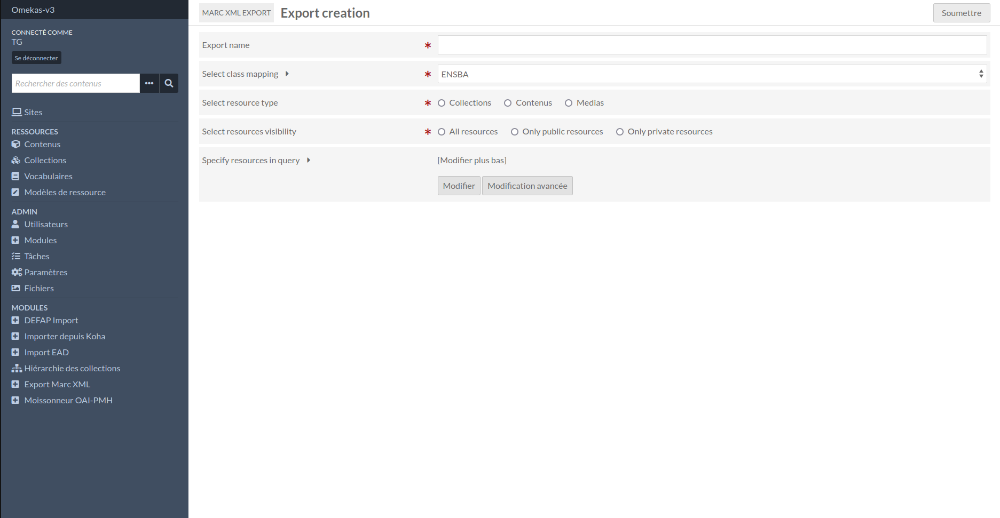
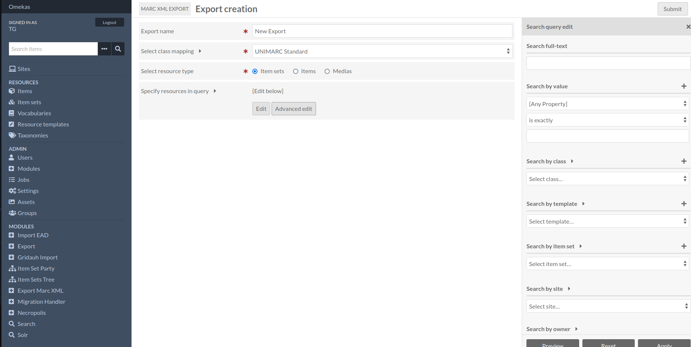

Tutorials
=========

Currently, product files are stored in a `~/files/Marc_XML_Export` folder, which you'll need to create.

To create a new export, simply submit the form, indicating : 
"The name of the export"
"The mapping to be used"
"Resource type"

You will be able to filter the resources using different criteria.

You can create a cron to clean up the files in the instance's export folder. See README for technical purpose.

:doc:`mapping-unimarc`
